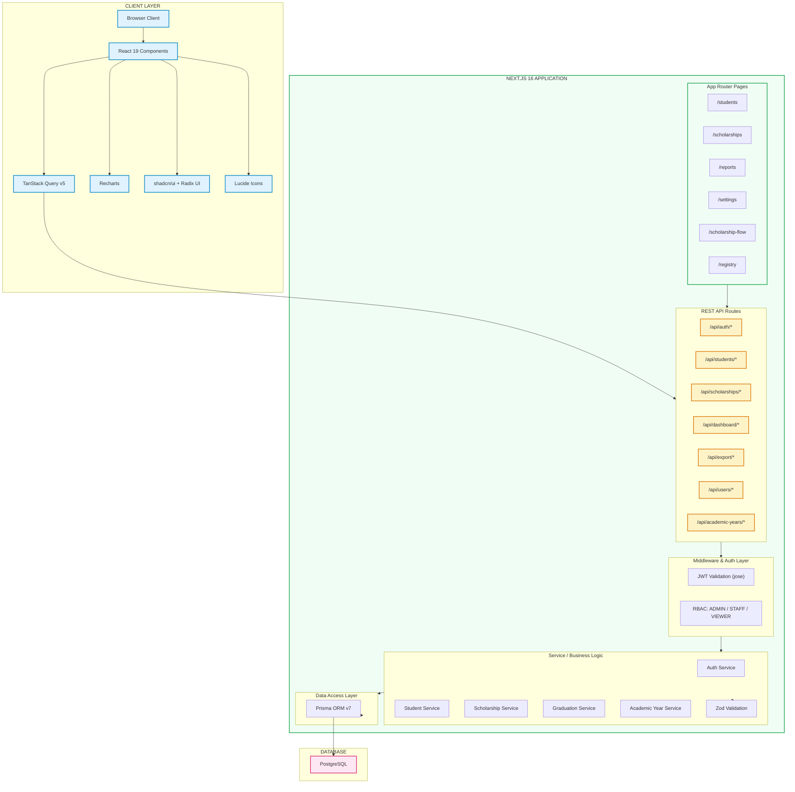

# ScholarTrack — Technical Reference

## Table of Contents

- [Architecture Overview](#architecture-overview)
- [Technology Stack](#technology-stack)
- [Project Structure](#project-structure)
- [Authentication Flow](#authentication-flow)
- [Database Schema](#database-schema)
- [Key Relationships](#key-relationships)
- [Role-Based Access Control (RBAC)](#role-based-access-control-rbac)
- [Performance Optimization](#performance-optimization)
- [TanStack Query Implementation](#tanstack-query-implementation)
- [Development Conventions](#development-conventions)
- [Deployment (Vercel)](#deployment-vercel)
- [Security](#security)
- [Troubleshooting](#troubleshooting)

---

## Architecture Overview



## Technology Stack

| Category             | Technology                                |
| -------------------- | ----------------------------------------- |
| **Framework**        | Next.js 16 (App Router)                   |
| **Language**         | TypeScript                                |
| **Database**         | PostgreSQL (via Prisma ORM v7)            |
| **Authentication**   | JWT + HTTP-only cookies (jose + bcryptjs) |
| **UI Library**       | React 19 + shadcn/ui + Radix UI           |
| **Styling**          | Tailwind CSS v4                           |
| **State Management** | TanStack Query (React Query v5)           |
| **Charts**           | Recharts                                  |
| **Exports**          | PDF (jsPDF), XLSX (ExcelJS), CSV          |
| **Testing**          | Vitest                                    |
| **Deployment**       | Vercel                                    |
| **Animation**        | GSAP, Motion, OGL                         |

## Project Structure

```
scholarship-tracking-system/
├── src/
│   ├── app/                        # Next.js App Router
│   │   ├── (dashboard)/            # Authenticated pages
│   │   │   ├── students/           # Student management
│   │   │   ├── scholarships/       # Scholarship management
│   │   │   ├── scholarship-flow/   # Comparative data (5-year view)
│   │   │   ├── reports/            # Reports and analytics
│   │   │   └── settings/           # User management (Admin only)
│   │   ├── api/                    # REST API routes
│   │   ├── login/                  # Login page
│   │   ├── layout.tsx              # Root layout
│   │   └── globals.css             # Global styles
│   ├── components/                 # React components
│   │   ├── ui/                     # shadcn/ui primitives
│   │   ├── dashboard/              # Dashboard widgets
│   │   ├── charts/                 # Recharts wrappers
│   │   ├── forms/                  # Form components
│   │   ├── layout/                 # Layout shell (sidebar, header)
│   │   └── auth/                   # Auth provider
│   ├── hooks/                      # TanStack Query hooks
│   │   ├── use-queries.ts          # Centralized queries & mutations
│   │   ├── use-api.ts              # API utilities
│   │   └── use-debounce.ts         # Debounce hook
│   ├── lib/                        # Utilities & services
│   │   ├── auth.ts                 # JWT authentication
│   │   ├── prisma.ts               # Prisma client singleton
│   │   ├── utils.ts                # General utilities
│   │   ├── validations.ts          # Zod schemas
│   │   ├── cache.ts                # Caching
│   │   ├── academic-year-service.ts
│   │   ├── graduation-service.ts
│   │   └── ...
│   └── types/                      # TypeScript definitions
├── prisma/
│   ├── schema.prisma               # Database schema
│   ├── schema-with-erd.prisma      # Schema with ERD annotations
│   ├── seed.ts                     # Seeding
│   └── migrations/                 # DB migrations
├── docs/                           # Documentation
├── tests/                          # Vitest tests
└── scripts/                        # Utility scripts
```

## Authentication Flow

```mermaid
sequenceDiagram
    participant C as Client
    participant S as Server
    participant DB as Database

    C->>S: POST /api/auth/login {username, password}
    S->>DB: Find user by username
    DB-->>S: User record
    S->>S: Verify password (bcryptjs)
    S->>S: Check account lockout
    S->>S: Generate JWT (jose)
    S->>DB: Create session
    DB-->>S: Session record
    S-->>C: Set-Cookie: session=&lt;jwt&gt;
    Note over S: Cache-Control: no-store

    C->>S: Subsequent requests (Cookie: session=&lt;jwt&gt;)
    S->>S: Verify JWT signature
    S->>S: Check expiration
    S->>S: Check RBAC permissions
    S-->>C: Protected resource
```

## Database Schema

### Core Tables

| Table               | Purpose                                    |
| ------------------- | ------------------------------------------ |
| **User**            | Authentication + RBAC (ADMIN/STAFF/VIEWER) |
| **Session**         | JWT-based login sessions                   |
| **AuditLog**        | System activity tracking                   |
| **Student**         | Student info, grade level, graduation      |
| **Scholarship**     | Program definitions, grant types           |
| **StudentScholarship** | Junction: student ↔ scholarship        |
| **StudentFees**     | Fee breakdown, subsidy per term            |
| **Disbursement**    | Payment tracking                           |
| **AcademicYear**    | Year + semester management                 |
| **Backup**          | Data backup records                        |

### Key Relationships

- **User** → **Session** (1:N), **AuditLog** (1:N), **Backup** (1:N)
- **Student** ↔ **Scholarship** (M:N via StudentScholarship)
- **Student** → **StudentFees** (1:N), **Disbursement** (1:N)
- **Scholarship** → **Disbursement** (1:N)
- **AcademicYear** → **StudentFees** (1:N), **Disbursement** (1:N)

## Role-Based Access Control (RBAC)

| Role     | Permissions                                                       |
| -------- | ---------------------------------------------------------------- |
| **ADMIN** | Full access — user management, student/scholarship CRUD, archive, graduation, settings |
| **STAFF** | Add/edit students and scholarships; view-only on reports and other modules |
| **VIEWER**| Read-only access for stakeholders                                 |

### Admin-Only Features

- Settings page (`/settings`) — user management
- Student archive/unarchive, fee-only editing, import
- Scholarship archive/unarchive
- Graduation management

## Performance Optimization

### Applied Optimizations

1. **Connection Pooling** — configured via DATABASE_URL parameters
2. **Database Indexes** — composite indexes for common query patterns
3. **Query Optimization** — database-level aggregation (`groupBy` instead of JS)
4. **Slow Query Detection** — automatic logging in production (>500ms)
5. **Debounced Search** — 300ms debounce on filter inputs
6. **Combined Endpoints** — single request for related data
7. **TanStack Query** — automatic caching + background refetching

## TanStack Query Implementation

### Query Hooks

All data fetching is centralized in `src/hooks/use-queries.ts`:

| Hook                        | Purpose                       |
| --------------------------- | ----------------------------- |
| `useDashboardStats()`       | Dashboard statistics          |
| `useStudents(params)`       | Student listing + filters     |
| `useStudent(id)`            | Single student details        |
| `useCreateStudent()`        | Create student mutation       |
| `useUpdateStudent()`        | Update student mutation       |
| `useDeleteStudent()`        | Delete student mutation       |
| `useScholarships(params)`   | Scholarship listing           |
| `useScholarshipFlow(...)`   | 5-year comparative data       |
| `useAcademicYears()`        | Academic year listing         |
| `useCreateAcademicYear()`   | Create academic year          |

### Query Keys

```typescript
queryKeys.students.lists();
queryKeys.students.detail(id);
queryKeys.scholarships.list({ type: 'CHED' });
queryKeys.dashboard.stats();
```

## Development Conventions

### Code Style

- **TypeScript**: strict mode enabled
- **Naming**: PascalCase components, kebab-case routes, camelCase functions/vars
- **Components**: Server Components by default; `'use client'` only when needed
- **API**: RESTful under `/api/*`, JSON responses `{ success, data?, error? }`
- **Validation**: Zod schemas for all request bodies

### Testing

- **Framework**: Vitest
- **Location**: Tests alongside source: `*.test.ts`
- **Coverage**: Unit tests for services, hooks, API routes

## Deployment (Vercel)

1. Connect repository to Vercel
2. Set environment variables in Vercel dashboard
3. Deploy (automatic on push to main branch)

### Environment Variables

```env
DATABASE_URL=<production-postgresql-url-with-pool-params>
JWT_SECRET=<secure-random-32-char-string>
SESSION_SECRET=<secure-random-string>
NEXTAUTH_URL=https://your-domain.vercel.app
NEXTAUTH_SECRET=<secure-random-string>
```

### Production Checklist

- [ ] Set unique seed/admin passwords in environment variables
- [ ] Configure connection pooling for production database
- [ ] Apply database indexes (`npm run db:add-indexes`)
- [ ] Enable error tracking and monitoring
- [ ] Review and update RBAC settings
- [ ] Configure CORS if needed
- [ ] Set up backup strategy
- [ ] Test all user roles and permissions
- [ ] Verify export functionality

## Security

1. **JWT** stored in HTTP-only cookies (XSS protection)
2. **bcryptjs** password hashing (cost factor 10)
3. **RBAC** on all API endpoints
4. **Zod** validation (input sanitization)
5. **Account lockout** after N failed attempts
6. **Audit logging** for all operations
7. **Prisma parameterized queries** (SQL injection prevention)

## Troubleshooting

### Common Issues

| Issue                       | Solution                                                |
| --------------------------- | ------------------------------------------------------- |
| Port 8080 in use            | Change port in `package.json` dev script                |
| Prisma client not generated | Run `npx prisma generate`                               |
| DB connection error         | Verify `DATABASE_URL` in `.env`                         |
| Auth not working            | Clear cookies, ensure `JWT_SECRET` matches              |
| Build fails                 | Run `npm run typecheck` to identify TS errors           |
| Slow queries                | Run `npm run db:add-indexes` to apply performance indexes |

### Performance Issues

**Slow queries after indexing?** — Run `ANALYZE` to update statistics, verify index usage with `EXPLAIN ANALYZE`.

**Connection pool exhaustion?** — Reduce `connection_limit` in DATABASE_URL, check pool dashboard.

**Memory issues?** — Reduce cache TTL in `query-optimizer.ts`, decrease `maxEntries`, monitor with `queryOptimizer.getStats()`.
